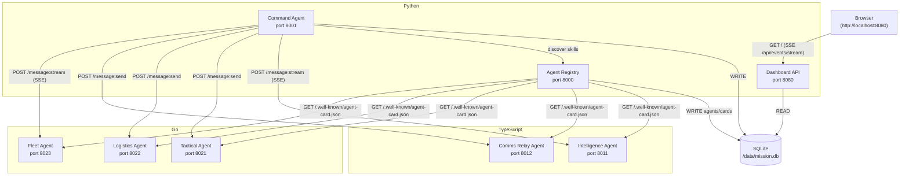
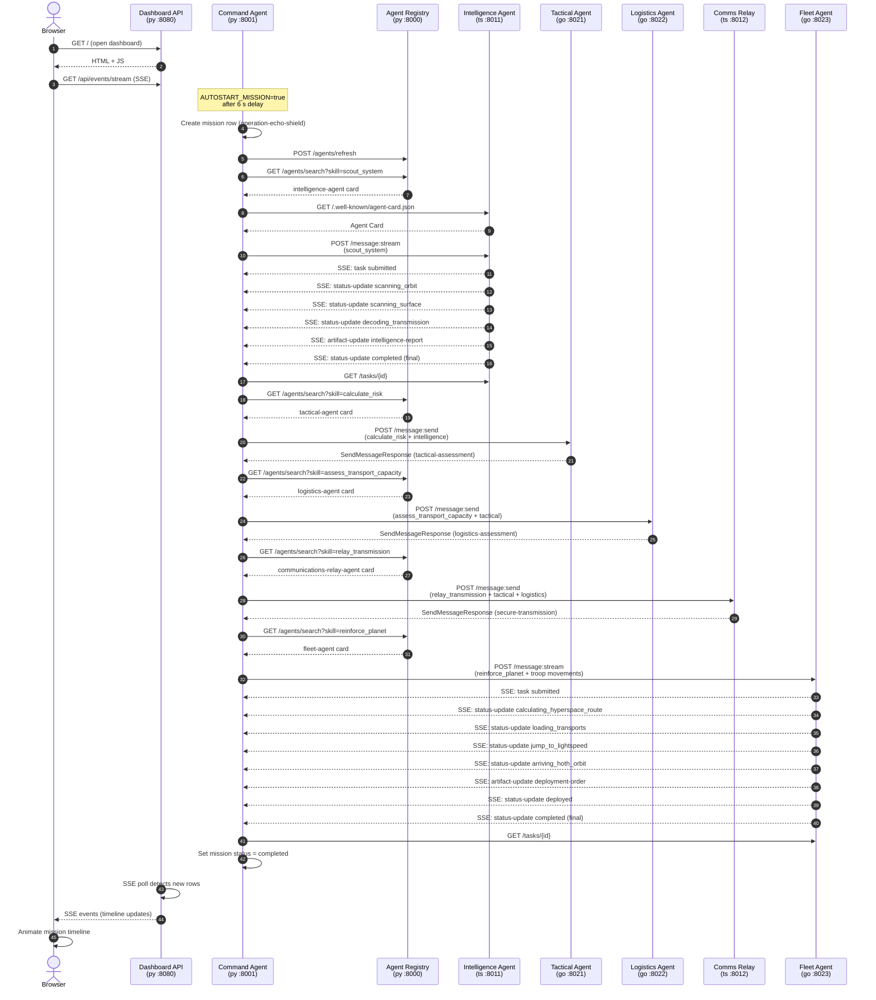

# Operation Echo Shield — A2A Multi-Language Demo

A fully working, multi-language demonstration of the
[Agent2Agent (A2A) Protocol](https://a2a-protocol.org) concepts: Agent Cards,
Messages, Parts, Tasks, TaskState, Artifacts, Context IDs, synchronous
request/response, and Server-Sent-Events (SSE) streaming.

The scenario is a Star Wars Resistance mission: Imperial forces are massing near
Hoth. Eight independent microservices — written in Python, TypeScript, and Go —
coordinate through the A2A HTTP+JSON wire protocol to scout the threat, assess
risk, plan logistics, secure a transmission, and deploy reinforcements to Echo
Base.

---

## 1. Project Overview

Operation Echo Shield shows how autonomous agents that have never directly
imported each other's code can still cooperate at runtime, using only the A2A
wire protocol and an Agent Card discovery mechanism. A browser dashboard renders
the mission timeline in real time as each agent completes its work.

Key learning outcomes:

- How an A2A **Agent Card** advertises capabilities without tight coupling.
- How an orchestrator **discovers** the right agent for each task at runtime by
  querying the registry for a skill ID.
- How **SSE streaming** lets a dashboard observe fine-grained task progress
  (scanning orbit, jump to lightspeed …) without polling.
- How **Artifacts** carry structured domain payloads from one agent to the next.
- How **Context IDs** and **Trace IDs** stitch a multi-hop mission into a single
  coherent audit trail.

---

## 2. A2A Concepts Demonstrated

| Concept | Where it appears |
|---|---|
| Agent Card (`GET /.well-known/agent-card.json`) | Every agent; fetched by the registry and the command agent at runtime |
| Skill discovery (`GET /agents/search?skill=<id>`) | Command agent discovers the right agent before each step |
| `POST /message:send` (sync) | Tactical, Logistics, Communications Relay |
| `POST /message:stream` (SSE) | Intelligence Agent, Fleet Agent |
| TaskState enum (`SUBMITTED` → `WORKING` → `COMPLETED`) | Streamed by Intel and Fleet, recorded in DB |
| Artifacts | Each agent returns a named, structured artifact |
| Context ID | `operation-echo-shield` threads all eight hops |
| Trace ID + Correlation ID | Mission-wide trace; per-hop correlation |
| `GET /tasks/{id}` (authoritative final task) | Command agent polls after every SSE stream |
| Error body (`{ "error": { "code": ... } }`) | Returned on 4xx/5xx by every service |
| `X-Demo-Token` auth header | Required on every A2A endpoint |
| Audit log | Every hop recorded in `audit_logs` table |

---

## 3. Why Three Languages

Each language demonstrates that the A2A protocol is a genuine HTTP+JSON wire
contract — not a library or SDK lock-in.

| Language | Services | Why |
|---|---|---|
| **Python** | Registry, Command Agent, Dashboard | Orchestration and persistence; FastAPI gives rapid async iteration |
| **TypeScript / Node.js** | Intelligence Agent, Communications Relay Agent | Native streaming ergonomics (async generators); idiomatic SSE |
| **Go** | Tactical Agent, Logistics Agent, Fleet Agent | Low-overhead HTTP servers; single-binary deployment; demonstrates Go streams |

None of the language runtimes share code. They interoperate only over HTTP.

---

## 4. System Architecture



The Docker network is named `resistance`. All services communicate by Docker DNS
name. Only the ports listed in section 6 are published to the host.

---

## 5. Agent List

| Agent | Language | Port | Role | Streaming |
|---|---|---|---|---|
| `agent-registry` | Python | 8000 | Discovers and caches Agent Cards | — |
| `resistance-command-agent` | Python | 8001 | Mission orchestrator | yes (own card) |
| `dashboard-api` | Python | 8080 | Browser UI + read-only REST + SSE feed | yes (SSE to browser) |
| `intelligence-agent` | TypeScript | 8011 | Scouts Hoth for Imperial forces | yes |
| `communications-relay-agent` | TypeScript | 8012 | Secures Resistance transmission | yes |
| `tactical-agent` | Go | 8021 | Calculates threat level and risk score | no |
| `logistics-agent` | Go | 8022 | Assesses transport capacity and fuel | no |
| `fleet-agent` | Go | 8023 | Deploys reinforcements to Hoth | yes |

---

## 6. Port List

| Port | Service |
|---|---|
| **8000** | Agent Registry |
| **8001** | Command Agent |
| **8011** | Intelligence Agent |
| **8012** | Communications Relay Agent |
| **8021** | Tactical Agent |
| **8022** | Logistics Agent |
| **8023** | Fleet Agent |
| **8080** | Dashboard (open this in a browser) |

---

## 7. Setup

Prerequisites:

- Docker Engine 24+ and Docker Compose v2 (the `docker compose` subcommand, not
  the legacy `docker-compose` binary).
- At least 2 GB of free RAM and 4 GB of disk space.
- Ports 8000, 8001, 8011, 8012, 8021, 8022, 8023, and 8080 available on the host.

No other dependencies. The build downloads all language runtimes inside Docker.

---

## 8. How to Run

```bash
# Clone or enter the repository root, then:
docker compose up --build
```

Docker Compose builds all eight images (one per service), starts the TypeScript
and Go agents first, waits for their health checks to pass, then starts the
Registry, and finally the Command Agent. The Dashboard starts in parallel.

The Command Agent automatically runs the mission approximately 6 seconds after
it becomes healthy.

Open the dashboard — the **Echo Command Interface**:

```
http://localhost:8080
```

The dashboard is a bespoke cinematic Resistance war-room console (custom
CSS + SVG/Canvas + vanilla JS — no frameworks, no external fonts/images, fully
offline). Live A2A messages animate as beams between agent nodes on a central
**holotable** (Python = diamond, TypeScript = triangle, Go = hexagon), the
timeline renders as decoded comm **packets** on a transmission spine, and the
right-hand operations stack shows the agent roster, troop movement, threat
assessment, logistics, dead-letter queue and audit log. Click any packet to open
the **Decoded Data Pad** inspector (Summary / Headers / Message / Task / Artifacts
/ Raw JSON, with the A2A-Version, correlation id and trace id). See the full
design language in [`docs/ui-design-system.md`](docs/ui-design-system.md) and
capture guidance in [`docs/screenshots.md`](docs/screenshots.md).

> A short boot sequence plays on first load (skippable with click/Esc); append
> `?static=1` to the URL for a one-shot static snapshot (skips the live SSE link
> and the radar animation — handy for headless screenshots). A `prefers-reduced-
> motion` setting disables all animation.

You will see the mission timeline animate in real time as the agents exchange
messages. The full mission completes in roughly 20–30 seconds.

To run in detached mode:

```bash
docker compose up --build -d
docker compose logs -f command-agent   # watch the orchestration
```

To stop:

```bash
docker compose down
```

---

## 9. Reset the Database

The SQLite database persists in a named Docker volume (`a2a-data`). To wipe it
and start a completely fresh mission:

```bash
docker compose down -v          # stops containers AND removes the volume
docker compose up --build       # rebuilds images, recreates volume, reruns mission
```

If you only want to rerun the mission without destroying the volume:

```bash
curl -X POST http://localhost:8080/api/run-mission
```

---

## 10. Replay a Mission

The dashboard supports client-side replay of any completed mission without
re-running the agents. Open the dashboard, then click the **Replay** button, or
call the endpoint directly:

```bash
curl http://localhost:8080/api/replay
```

The response contains every `transmissions` row in chronological order. The
browser uses this data to re-animate the timeline without generating new network
traffic to the agents.

To replay from the terminal (pretty-printed):

```bash
curl -s http://localhost:8080/api/replay | python3 -m json.tool | less
```

---

## 11. Inspect Agent Cards

Each agent exposes its Agent Card at the standard A2A well-known URL with no
authentication required.

```bash
# Intelligence Agent (TypeScript)
curl http://localhost:8011/.well-known/agent-card.json | python3 -m json.tool

# Communications Relay Agent (TypeScript)
curl http://localhost:8012/.well-known/agent-card.json | python3 -m json.tool

# Tactical Agent (Go)
curl http://localhost:8021/.well-known/agent-card.json | python3 -m json.tool

# Logistics Agent (Go)
curl http://localhost:8022/.well-known/agent-card.json | python3 -m json.tool

# Fleet Agent (Go)
curl http://localhost:8023/.well-known/agent-card.json | python3 -m json.tool

# Command Agent (Python)
curl http://localhost:8001/.well-known/agent-card.json | python3 -m json.tool
```

The registry aggregates all cards:

```bash
curl http://localhost:8000/agents | python3 -m json.tool
```

Search by skill:

```bash
curl "http://localhost:8000/agents/search?skill=scout_system" | python3 -m json.tool
```

---

## 12. Inspect Raw A2A Messages

The dashboard persists every request and response JSON the Command Agent sends
and receives. Use the **Message Inspector** panel in the browser, or query
directly:

```bash
# List the timeline (transmissions)
curl http://localhost:8080/api/timeline | python3 -m json.tool

# Get raw request/response for a specific message (replace <message_id>)
curl "http://localhost:8080/api/messages/<message_id>" | python3 -m json.tool

# List all persisted tasks
curl http://localhost:8080/api/tasks | python3 -m json.tool

# List all artifacts
curl http://localhost:8080/api/artifacts | python3 -m json.tool

# Live SSE feed (watch in terminal)
curl -N http://localhost:8080/api/events/stream
```

---

## 13. Example Requests and Responses

### Health check (any agent)

```
GET http://localhost:8011/health
```

```json
{ "status": "ok", "agent": "intelligence-agent", "language": "typescript" }
```

### Send a task to the Intelligence Agent

```bash
curl -s -X POST http://localhost:8011/message:send \
  -H "Content-Type: application/json" \
  -H "A2A-Version: 1.0" \
  -H "X-Correlation-ID: corr-manually-01" \
  -H "X-Trace-ID: trace-manually-01" \
  -H "X-Demo-Token: resistance-demo-token" \
  -d '{
    "message": {
      "messageId": "msg-manual-01",
      "contextId": "my-test-context",
      "role": "ROLE_USER",
      "parts": [
        { "text": "Scout the Hoth system for Imperial movement.", "mediaType": "text/plain" },
        { "data": { "mission": "my-test-context", "system": "Hoth", "skill": "scout_system" }, "mediaType": "application/json" }
      ],
      "metadata": { "sender": "human", "recipient": "intelligence-agent", "skillId": "scout_system" }
    },
    "configuration": { "acceptedOutputModes": ["application/json"] }
  }' | python3 -m json.tool
```

Abbreviated response:

```json
{
  "task": {
    "id": "task-<uuid>",
    "contextId": "my-test-context",
    "status": {
      "state": "TASK_STATE_COMPLETED",
      "timestamp": "2026-06-23T10:15:00.000Z",
      "metadata": { "phase": "completed", "display": "Scan complete." }
    },
    "artifacts": [
      {
        "artifactId": "art-<uuid>",
        "name": "intelligence-report",
        "parts": [{
          "data": {
            "system": "Hoth",
            "empire_presence": true,
            "confidence": 0.94,
            "detected_units": {
              "stormtroopers": 1800,
              "at_at_walkers": 12,
              "at_st_walkers": 28,
              "star_destroyers": 3,
              "probe_droids": 9
            }
          },
          "mediaType": "application/json"
        }]
      }
    ]
  }
}
```

### Stream a task from the Fleet Agent

```bash
curl -s -N -X POST http://localhost:8023/message:stream \
  -H "Content-Type: application/json" \
  -H "A2A-Version: 1.0" \
  -H "X-Correlation-ID: corr-manually-02" \
  -H "X-Trace-ID: trace-manually-02" \
  -H "X-Demo-Token: resistance-demo-token" \
  -d '{
    "message": {
      "messageId": "msg-manual-02",
      "contextId": "my-test-context",
      "role": "ROLE_USER",
      "parts": [
        { "text": "Deploy reinforcements to Hoth.", "mediaType": "text/plain" },
        { "data": { "destination": "Hoth", "troops": { "reinforce_echo_base": 1200, "evacuate_civilians": 700, "reserve_defensive_units": 300 }, "skill": "reinforce_planet" }, "mediaType": "application/json" }
      ],
      "metadata": { "sender": "human", "recipient": "fleet-agent", "skillId": "reinforce_planet" }
    },
    "configuration": { "acceptedOutputModes": ["application/json"] }
  }'
```

The server returns a sequence of SSE events:

```
event: task
data: {"kind":"task","task":{"id":"task-...","status":{"state":"TASK_STATE_SUBMITTED",...}}}

event: status-update
data: {"kind":"status-update","taskId":"task-...","status":{"state":"TASK_STATE_WORKING","metadata":{"phase":"calculating_hyperspace_route",...}},"final":false}

event: status-update
data: {"kind":"status-update","taskId":"task-...","status":{"state":"TASK_STATE_WORKING","metadata":{"phase":"jump_to_lightspeed",...}},"final":false}

event: artifact-update
data: {"kind":"artifact-update","taskId":"task-...","artifact":{"name":"deployment-order","parts":[{"data":{"deployment_status":"DEPLOYED","destination":"Hoth","eta_minutes":18,...},"mediaType":"application/json"}]},"final":false}

event: status-update
data: {"kind":"status-update","taskId":"task-...","status":{"state":"TASK_STATE_COMPLETED","metadata":{"phase":"completed",...}},"final":true}
```

### Error response example

```json
{
  "error": {
    "code": "TASK_NOT_FOUND",
    "message": "No task task-does-not-exist",
    "httpStatus": 404,
    "correlationId": "corr-manually-01"
  }
}
```

---

## 14. Troubleshooting

**The dashboard is blank or shows no timeline events.**
The Command Agent has not yet run the mission. Wait about 10–15 seconds after
`docker compose up` for all health checks to pass. Check logs with:
```bash
docker compose logs command-agent
```

**A service fails to start with "port already in use" / "port is already allocated".**
Another process on your host already owns one of the eight published ports. You
do **not** need to edit `docker-compose.yml` — every published host port is
overridable via an environment variable (the in-container ports and all
inter-agent URLs are unchanged, so only your browser/curl target moves). Copy
`.env.example` to `.env` and set the one that collides, then `docker compose up`
again. For example, if something already uses `8001`:
```bash
echo "COMMAND_HOST_PORT=18001" >> .env
docker compose up -d
```
The variables are `REGISTRY_HOST_PORT` (8000), `COMMAND_HOST_PORT` (8001),
`DASHBOARD_HOST_PORT` (8080), `INTEL_HOST_PORT` (8011), `RELAY_HOST_PORT` (8012),
`TACTICAL_HOST_PORT` (8021), `LOGISTICS_HOST_PORT` (8022), `FLEET_HOST_PORT`
(8023). The bundled `scripts/*.sh` read the same `.env`, so `make smoke`,
`make health`, and `make mission` automatically target the overridden ports.

**Build fails on the TypeScript or Go services.**
Ensure you have network access during `docker compose up --build` — the build
downloads npm packages and Go modules. On a slow connection, increase the
Docker build timeout.

**The mission runs but some agents return 401.**
The `X-Demo-Token` header is missing or the service was restarted with a
different `A2A_DEMO_TOKEN` value in the environment. The default token is
`resistance-demo-token`. Check `docker-compose.yml`.

**SQLite "database is locked" errors.**
Only Python services write to the database. Ensure no stale containers are
holding the volume. Run `docker compose down -v` then restart.

**`curl: (52) Empty reply from server` on the SSE endpoint.**
You need `curl -N` (the `--no-buffer` flag) to keep the SSE connection open
and print events as they arrive.

**The replay button shows an empty timeline.**
The mission has not completed yet. Wait for the Command Agent log to print
"Operation Echo Shield completed."

---

## 15. Known Simplifications vs. the Full A2A Spec

This demo implements a faithful educational **subset** of the A2A protocol.
The following are intentional simplifications:

| Area | Demo behaviour | Full spec |
|---|---|---|
| **Auth** | Any non-empty `X-Demo-Token` value is accepted | Real OAuth2 / mTLS |
| **Push notifications** | Not implemented (`pushNotifications: false` in all cards) | Webhook callbacks to caller |
| **Task cancellation** | Endpoint exists; streaming tasks reject cancel mid-stream | Full lifecycle management |
| **`TASK_STATE_INPUT_REQUIRED` / `AUTH_REQUIRED`** | Not exercised | Multi-turn agent dialogues |
| **Part types** | Only `text` and `data` parts | File and blob parts |
| **Pagination** | `pageSize` query param honoured but no `nextPageToken` | Cursor-based pagination |
| **Agent Card versioning** | Single version, no diff or migration | Card version negotiation |
| **Multi-tenant context IDs** | Single fixed context `operation-echo-shield` | Arbitrary contexts per caller |
| **Persistence** | Go and TypeScript agents are stateless (in-memory only) | All agents may persist |
| **mTLS** | Plain HTTP inside Docker network | Mutual TLS in production |

---

## 16. Implemented Bonus Features

Beyond the core A2A flow, the demo implements several resilience and validation
bonuses (the normative conventions live in `docs/protocol.md` §17). Each ships
with a one-command demo via `make`.

### 16.1 Failure simulation + dead-letter queue

The Command Agent is gated by `FAILURE_SIMULATION` (default `false`, see
`.env.example`). When set to `true`, at mission start and **before** the real
orchestration sequence it:

- fires one **transient** failure on the first attempt of a real hop so the
  existing exponential-backoff retry (3 attempts) visibly recovers on attempt 2,
  recording each attempt in the `audit_logs` table; and
- fires one **doomed** call to an unreachable URL that exhausts all retries and
  is written to the new `dead_letters` table and surfaced on the timeline as a
  `status="dead-letter"` transmission.

With the default `false`, none of this runs and the mission is a clean 10/10.

```bash
make demo-resilience
```

This recreates only the command-agent with `FAILURE_SIMULATION=true`, reruns the
mission, asserts at least one dead letter via `GET /api/dead-letters`, prints the
retry/backoff `audit_logs` rows, and then restores the default clean path.

### 16.2 Dead-Letter Queue panel

`GET /api/dead-letters` returns the rows from the `dead_letters` table, and the
dashboard renders a **Dead-Letter Queue** panel. It shows
"nominal — no dead letters" on a clean run and lists each exhausted message
(recipient, attempts, last error) after `make demo-resilience`.

### 16.3 Agent Card caching with ETag

Every `GET /.well-known/agent-card.json` response (all six agents + the registry)
carries a strong `ETag` of the form `"a2a-<first 16 hex of sha256(card)>"`. A
request that sends a matching `If-None-Match` receives **`304 Not Modified`**
with an empty body. The registry stores each card's ETag and sends
`If-None-Match` on refresh, so an unchanged card returns `304` and the cache is
kept. You can observe it directly:

```bash
ETAG=$(curl -sS -D - -o /dev/null http://localhost:8011/.well-known/agent-card.json | awk -F': ' '/[Ee][Tt]ag/{print $2}' | tr -d "\r")
curl -sS -o /dev/null -w '%{http_code}\n' -H "If-None-Match: ${ETAG}" http://localhost:8011/.well-known/agent-card.json   # -> 304
```

### 16.4 Protocol version-mismatch negotiation

On every authenticated A2A request, the Python command agent and registry reject
an `A2A-Version` header whose **major** component differs from `1` (e.g. `9.9`)
with HTTP **`400`** and error `code: "VERSION_NOT_SUPPORTED"`. A matching or
absent version passes.

```bash
make demo-version
```

This asserts that `A2A-Version: 9.9` is rejected with `400` +
`VERSION_NOT_SUPPORTED` and that `A2A-Version: 1.0` is **not** a `400`.

### 16.5 JSON Schema validation

The dashboard bakes the `shared/schemas` and `shared/examples` directories into
its image and exposes `GET /api/schema-validation`, which validates every
`shared/examples/*.json` against its schema `$def` and validates each **live**
agent card against `agent-card.schema.json`. The response is
`{ "allValid": ..., "results": [ { "name", "schema", "valid", "errors" } ] }`.

```bash
make validate
```

The script prints each result name with `valid`/`invalid` and exits non-zero if
`allValid` is `false`.

### 16.6 Dashboard visualizations

- **Planet Risk Heatmap** panel: colors the Hoth cell by the tactical
  `risk_score` / `threat_level` (green `<40`, amber `40–69`, red `>=70`). With
  the canonical mission numbers Hoth scores `91` → red / `HIGH`.
- **Fleet Route** visualization: an SVG path Rendezvous → Hyperspace → Hoth
  Orbit → Echo Base that highlights the fleet's current phase, driven live by the
  Fleet Agent's streamed status updates and the `deployment-order` artifact.

---

## 17. Future Enhancements

- **Push notifications**: Add a webhook callback URL to the
  `SendMessageRequest.configuration` and have streaming agents POST status
  updates to the caller instead of requiring the caller to subscribe.
- **Multi-mission support**: Allow multiple concurrent `contextId` values so
  several missions can run in parallel.
- **Frontend agent graph**: Render the live agent-to-agent call graph as an
  animated force-directed diagram using the `transmissions` table.
- **Agent Card versioning**: Version-stamp each card fetch and surface diffs in
  the dashboard.
- **Kubernetes deployment**: Add Helm charts so the demo can run on a real
  cluster with proper service discovery.
- **Real LLM integration**: Replace the deterministic agent logic with calls to
  a language model, keeping the same A2A wire protocol.

---

## Mission Sequence Diagram


