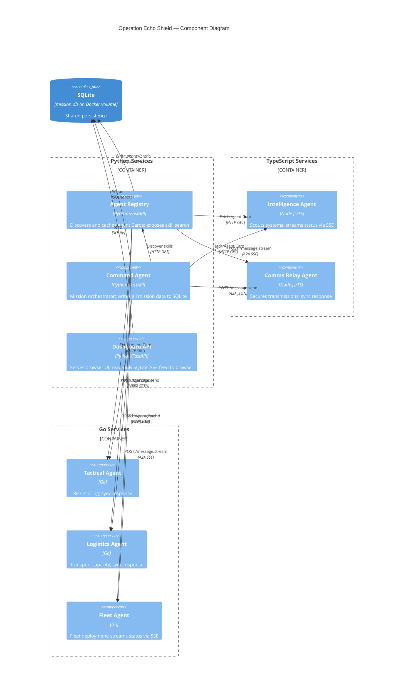

# Architecture — Operation Echo Shield

## Overview

Operation Echo Shield is composed of eight independent HTTP microservices that
communicate exclusively over the A2A HTTP+JSON wire protocol. No service imports
code from another service. The only shared resource is a SQLite database file on
a Docker named volume (`a2a-data`), written only by the three Python services.

---

## Components

### Python Services

**Agent Registry** (`agent-registry`, port 8000)

The registry is the service directory for the demo. On startup it reads the
`AGENT_ENDPOINTS` environment variable (a comma-separated list of
`name|language|baseUrl` triples), fetches each agent's
`/.well-known/agent-card.json` with retry/backoff, and persists the results in
the shared SQLite database (`agents` and `agent_cards` tables). It exposes a
REST API that the Command Agent queries to discover which agent owns a given
skill ID. It is not an A2A agent itself (it does not serve `/message:*`).

**Command Agent** (`resistance-command-agent`, port 8001)

The orchestrator. Implements the full A2A endpoint set plus a custom
`POST /mission:start` endpoint. When `AUTOSTART_MISSION=true`, it waits for the
registry to be healthy, then executes the 13-step Operation Echo Shield sequence
(see `docs/sequence-diagram.md`). It is the sole writer of mission data to
SQLite: `missions`, `messages`, `tasks`, `task_status_updates`, `artifacts`,
`transmissions`, and `audit_logs`. It also serves a valid Agent Card so it
appears as a registered agent.

**Dashboard API** (`dashboard-api`, port 8080)

Serves the browser dashboard (HTML, CSS, JavaScript) and a set of read-only REST
endpoints backed by SQLite. It also publishes a live Server-Sent-Events feed
(`GET /api/events/stream`) that polls the database every ~500 ms and pushes new
`transmissions` rows, `task_status_updates`, and mission state changes to
connected browsers.

### TypeScript / Node.js Services

**Intelligence Agent** (`intelligence-agent`, port 8011)

Implemented in TypeScript (Node.js). Scouts a star system for Imperial activity.
Exposes streaming via `POST /message:stream`. During a stream it emits four
status-update phases (`scanning_orbit`, `scanning_surface`,
`decoding_transmission`, then `completed`) interspersed with an
`artifact-update` carrying the `intelligence-report`. Keeps an in-memory task
store; never writes to SQLite.

**Communications Relay Agent** (`communications-relay-agent`, port 8012)

Implemented in TypeScript (Node.js). Wraps tactical and logistics payloads into
a secure Resistance transmission. Responds synchronously on `POST /message:send`.
Computes a deterministic SHA-256-based checksum and base64-encodes the payload.
Never writes to SQLite.

### Go Services

**Tactical Agent** (`tactical-agent`, port 8021)

Compiled Go binary. Calculates a deterministic risk score from the intelligence
report using the formula:
`risk = min(100, star_destroyers*15 + at_at_walkers*2 + at_st_walkers*1 + stormtroopers/100 + probe_droids*1)`.
With the canonical intelligence numbers the score is 91 (`HIGH`). Responds
synchronously on `POST /message:send`. Stateless; no database.

**Logistics Agent** (`logistics-agent`, port 8022)

Compiled Go binary. Assesses transport capacity, fuel levels, and recommended
troop movements based on the system name and the tactical assessment. Returns
fixed deterministic numbers (14 transports, 22 X-wings, fuel at 82 %,
evacuation capacity 4200). Responds synchronously on `POST /message:send`.
Stateless.

**Fleet Agent** (`fleet-agent`, port 8023)

Compiled Go binary. Deploys reinforcements to the destination planet. Implements
`POST /message:stream` with six phases: `calculating_hyperspace_route`,
`loading_transports`, `jump_to_lightspeed`, `arriving_hoth_orbit`, `deployed`,
`completed`. Emits a `deployment-order` artifact. Stateless.

---

## Languages

| Language | Services | Runtime |
|---|---|---|
| Python 3.12 | Registry, Command, Dashboard | FastAPI + Uvicorn |
| TypeScript | Intelligence, Comms Relay | Node.js 20, tsx |
| Go 1.22 | Tactical, Logistics, Fleet | net/http standard library |

Each language was chosen deliberately:

- Python for orchestration and persistence — async I/O, rich standard library,
  easy SQLite integration.
- TypeScript for streaming agents — async generators and iterable streams map
  naturally to SSE.
- Go for the synchronous and streaming compute agents — single binary, minimal
  memory footprint, clear concurrency model.

---

## Data Flow

```
Browser  ──GET /────────────────────────► Dashboard API (reads SQLite)
         ◄─── SSE /api/events/stream ────

Command Agent
  │
  ├─ POST /agents/refresh ──────────────► Registry
  ├─ GET  /agents/search?skill= ────────► Registry ──► SQLite (read)
  │
  ├─ POST /message:stream ──────────────► Intelligence Agent
  │      SSE events ◄───────────────────
  │      GET /tasks/{id} ───────────────►
  │
  ├─ POST /message:send ────────────────► Tactical Agent
  │      SendMessageResponse ◄──────────
  │
  ├─ POST /message:send ────────────────► Logistics Agent
  │      SendMessageResponse ◄──────────
  │
  ├─ POST /message:send ────────────────► Comms Relay Agent
  │      SendMessageResponse ◄──────────
  │
  └─ POST /message:stream ──────────────► Fleet Agent
         SSE events ◄───────────────────
         GET /tasks/{id} ───────────────►

Command Agent ──WRITE──► SQLite (missions, messages, tasks,
                                  task_status_updates, artifacts,
                                  transmissions, audit_logs)

Registry ──WRITE──► SQLite (agents, agent_cards)
```

---

## Persistence

The database is a single SQLite file at `${A2A_DB_PATH:-/data/mission.db}`,
mounted from the `a2a-data` Docker named volume. Only the Python services access
it. WAL journal mode and a 5-second busy timeout are set at connection open to
allow safe concurrent reads.

| Table | Writer | Purpose |
|---|---|---|
| `agents` | Registry | One row per discovered agent |
| `agent_cards` | Registry | Raw Agent Card JSON per agent |
| `missions` | Command | One row per mission run |
| `messages` | Command | Full request/response JSON per A2A hop |
| `tasks` | Command | A2A tasks observed on remote agents |
| `task_status_updates` | Command | Streaming status-update events |
| `artifacts` | Command | Structured artifact payloads |
| `transmissions` | Command | Human-friendly timeline events |
| `audit_logs` | Command | Trace/correlation audit trail |

The Dashboard API is read-only. Go and TypeScript agents never open the file.

---

## Component Diagram



---

## Network Topology

All services share the `resistance` Docker bridge network. Services address each
other by Docker Compose service name (e.g. `http://intelligence-agent:8011`).
The host machine accesses services only through the published port bindings
listed in the README.

## Startup Order

Docker Compose health checks enforce this dependency chain:

```
TypeScript agents (8011, 8012)  ─┐
Go agents (8021, 8022, 8023)    ─┤─► healthy ─► Agent Registry (8000)
                                  │               └─► healthy ─► Command Agent (8001)

Dashboard API (8080) starts in parallel — it tolerates an empty database
and begins serving the UI immediately.
```

The Command Agent waits an additional `MISSION_START_DELAY_SECONDS` (default 6)
after becoming healthy before executing the mission, giving the registry time to
finish its initial card-fetch sweep.
