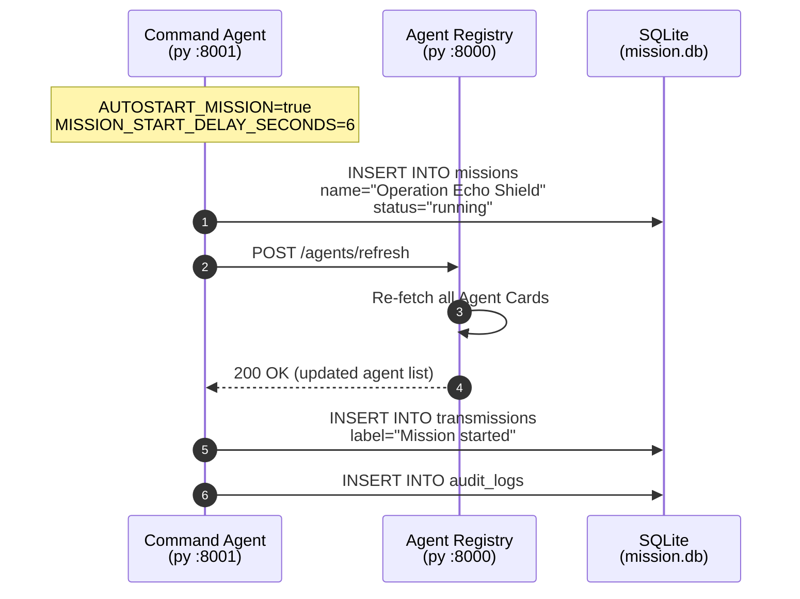
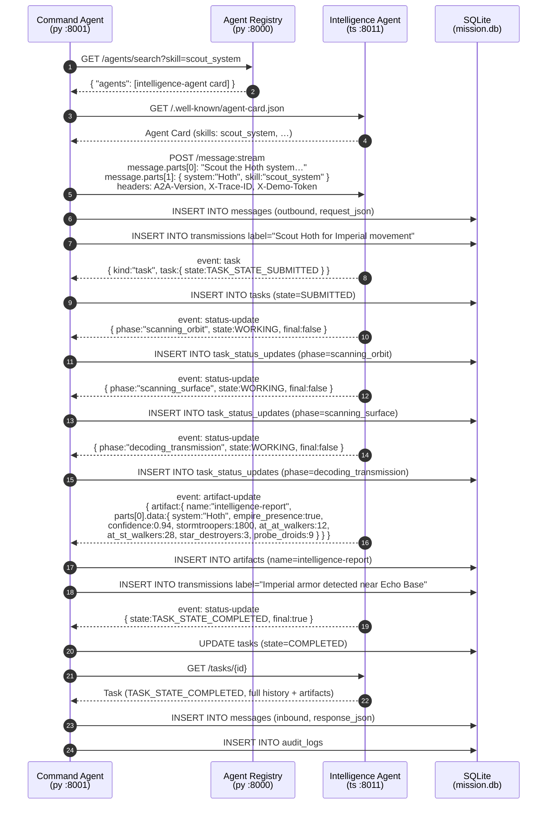
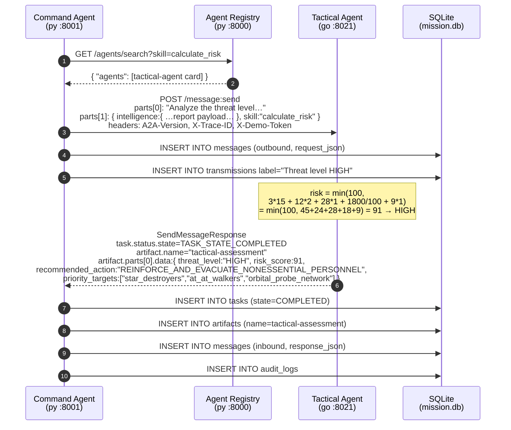
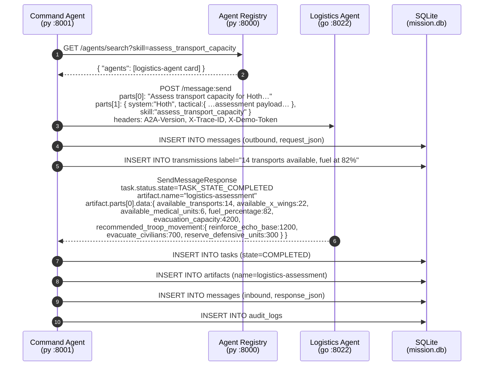
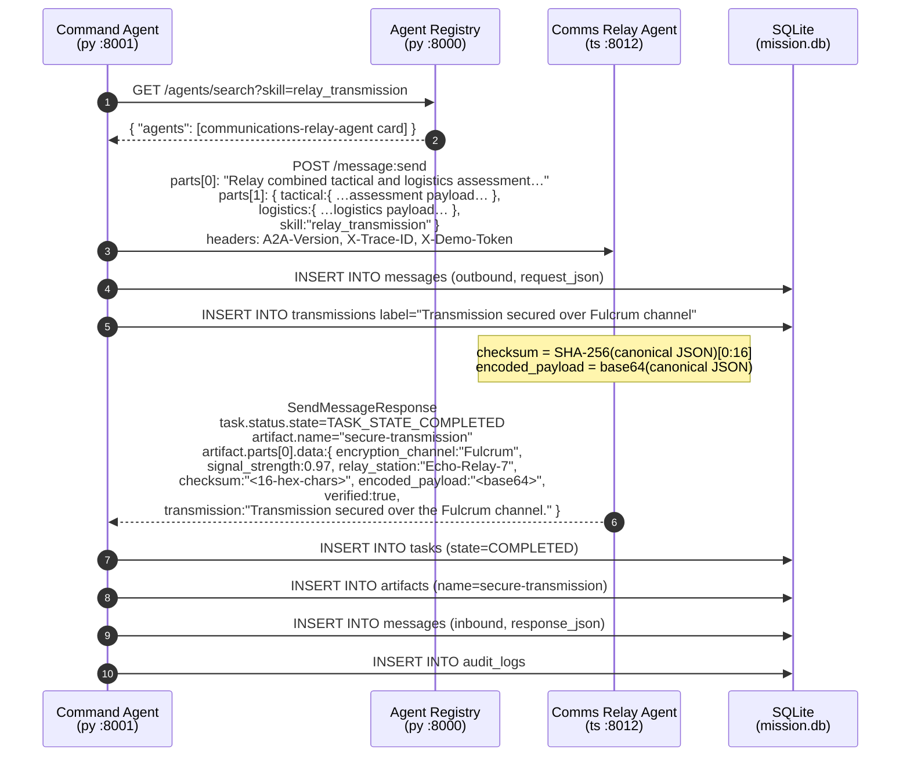
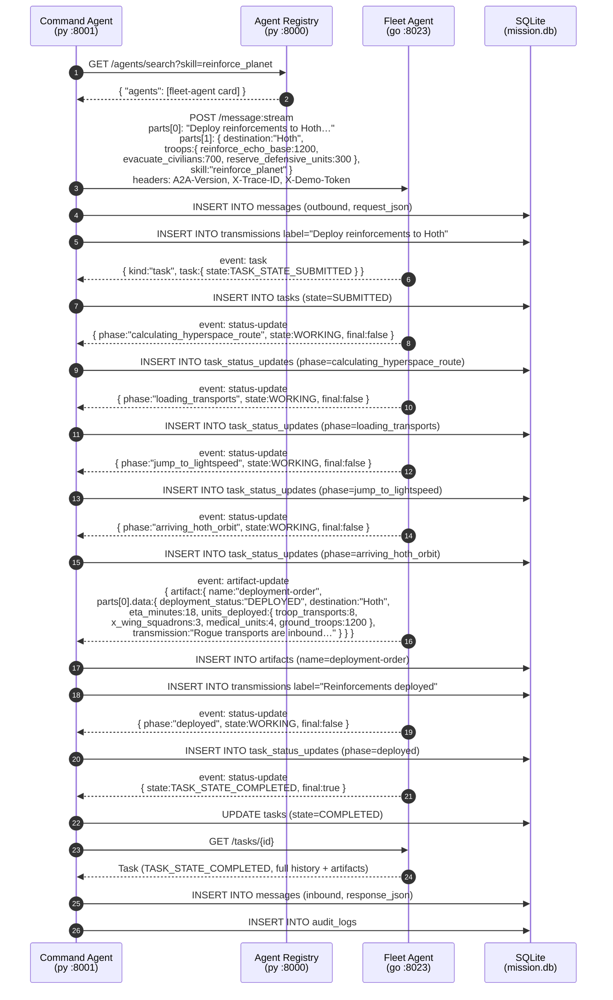
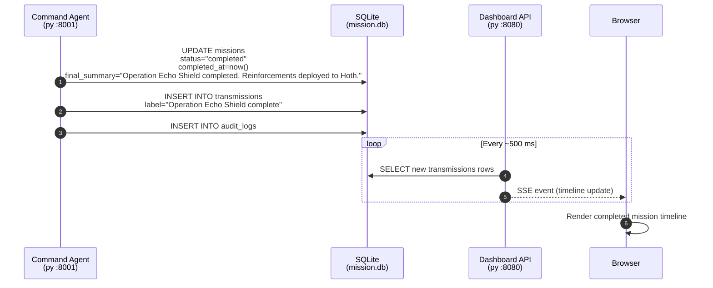

# Sequence Diagram — Operation Echo Shield

This document provides a detailed Mermaid sequence diagram of the complete
mission. Every A2A message, SSE stream event, artifact, and database write is
shown in order.

The mission runs automatically on Command Agent startup
(`AUTOSTART_MISSION=true`). All hops share the context ID
`operation-echo-shield` and a single mission-wide `traceId`; each hop uses a
fresh `correlationId`.

---

## Phase 1 — Mission Initialization

The Command Agent creates the mission row in SQLite and primes the registry.

---

## Phase 2 — Scout Hoth (Intelligence Agent, streaming)

The Command Agent discovers the Intelligence Agent via the registry, verifies its
card, then opens an SSE stream. Each `status-update` event is recorded in
`task_status_updates`. After the stream closes the authoritative task is fetched.

---

## Phase 3 — Tactical Analysis (Tactical Agent, synchronous)

---

## Phase 4 — Logistics Assessment (Logistics Agent, synchronous)

---

## Phase 5 — Secure Transmission (Communications Relay Agent, synchronous)

---

## Phase 6 — Fleet Deployment (Fleet Agent, streaming)

---

## Phase 7 — Mission Completion

---

## Artifact Summary

| Step | Agent | Artifact name | Key fields |
|---|---|---|---|
| 2 | Intelligence Agent | `intelligence-report` | `empire_presence`, `confidence`, `detected_units` |
| 3 | Tactical Agent | `tactical-assessment` | `threat_level`, `risk_score`, `recommended_action` |
| 4 | Logistics Agent | `logistics-assessment` | `available_transports`, `fuel_percentage`, `recommended_troop_movement` |
| 5 | Comms Relay Agent | `secure-transmission` | `encryption_channel`, `checksum`, `encoded_payload`, `verified` |
| 6 | Fleet Agent | `deployment-order` | `deployment_status`, `eta_minutes`, `units_deployed` |

Each artifact travels as `parts[0].data` inside an `Artifact` object; the
receiving agent (Command Agent) deserialises `parts[0].data` to feed the next
step.
